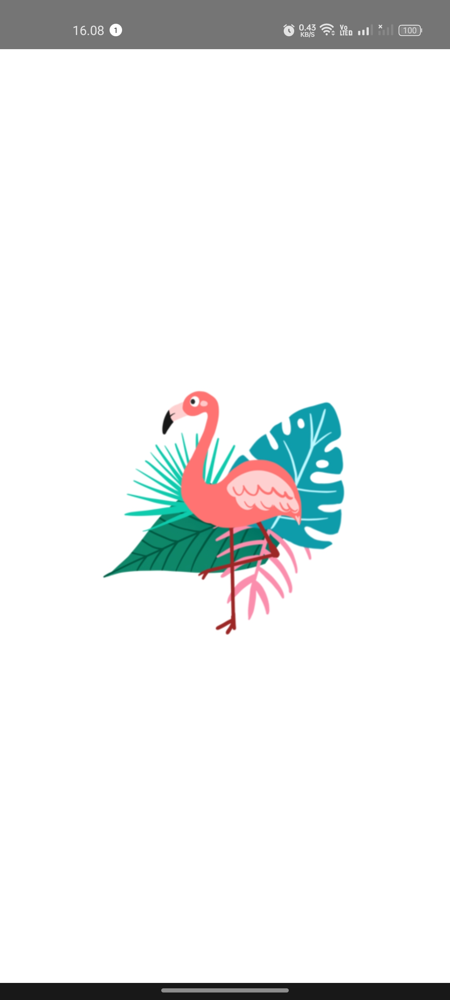
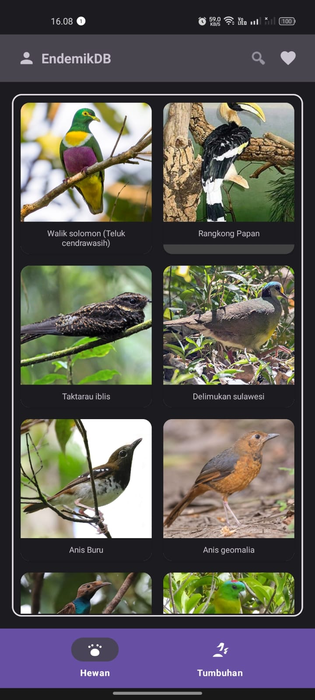
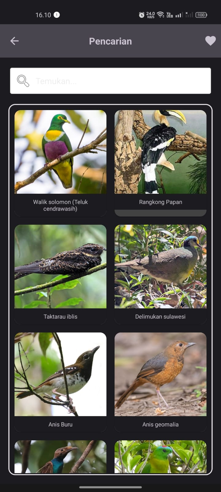
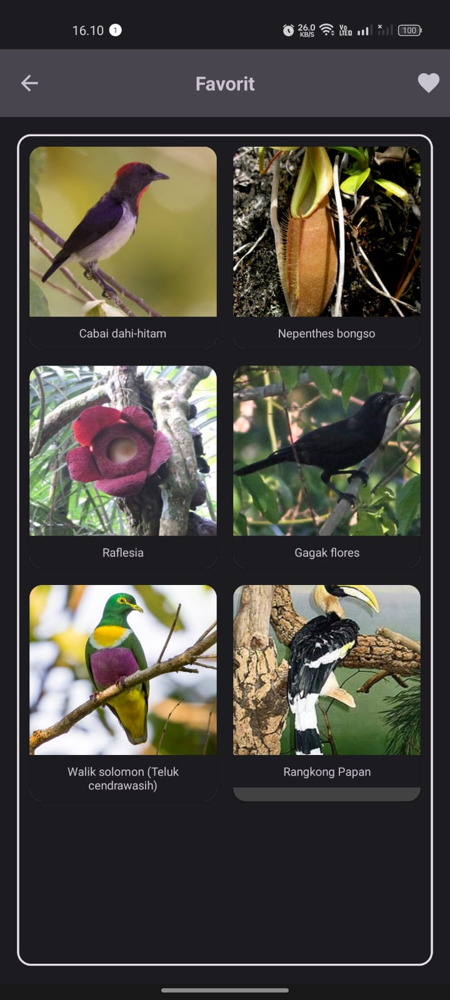
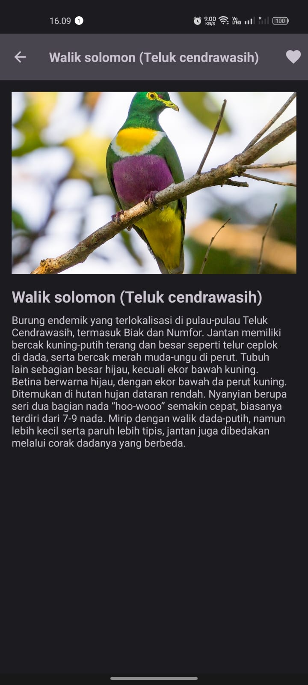
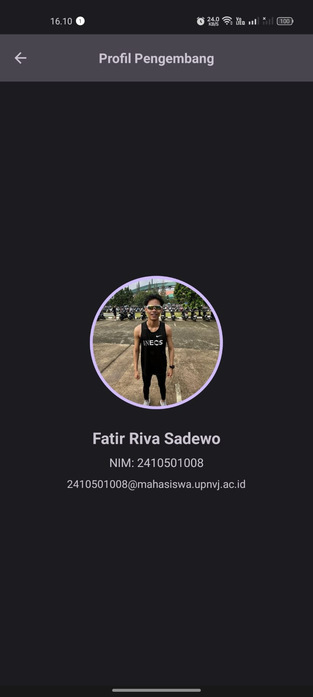

# UAS Mobile Programming

## Ketentuan Tugas
* Tema (Dark & Light Mode)
* Aktivitas: Splash, Home, Pencarian, Detail, Favorit
* Database: ROOM dengan 2 tabel (endemik & favorit)
* Foto dan Nama Pengembang

### Tangkapan Layar (Screenshots)

| Splash Screen | Home Screen |
| :---: | :---: |
|  |  |

| Search Screen | Favorite Screen |
| :---: | :---: |
|  |  |

| Detail Screen | Profile Screen |
| :---: | :---: |
|  |  |

### Pengembang
* **Nama**: Fatir Riva Sadewo
* **NIM**: 2410501008
* **Email**: 2410501008@mahasiswa.upnvj.ac.id
* **Universitas**: UPN "Veteran" Jakarta